 

# Dileit
`Dileit` is an android dictionary app which helps you to memorize its words! (totally free and open-source)

**Overview**
---

**1-MainPage**

find all paths here! start-up page.

 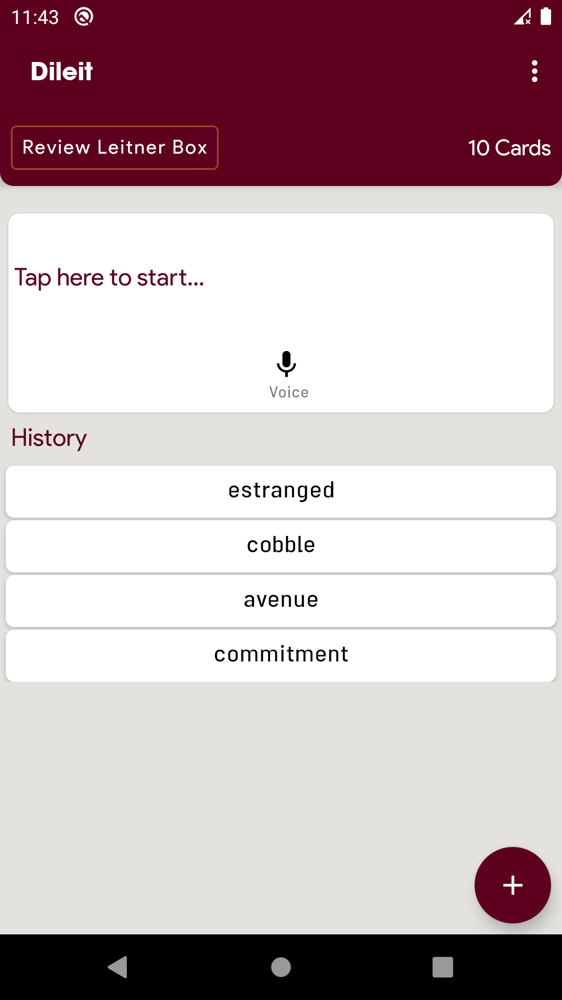

**2-Dictionary**

`Dileit` has two dictionary database with more than 300k records in each one!

 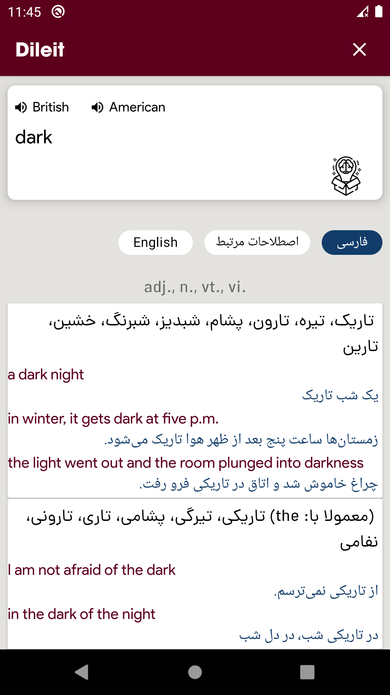
 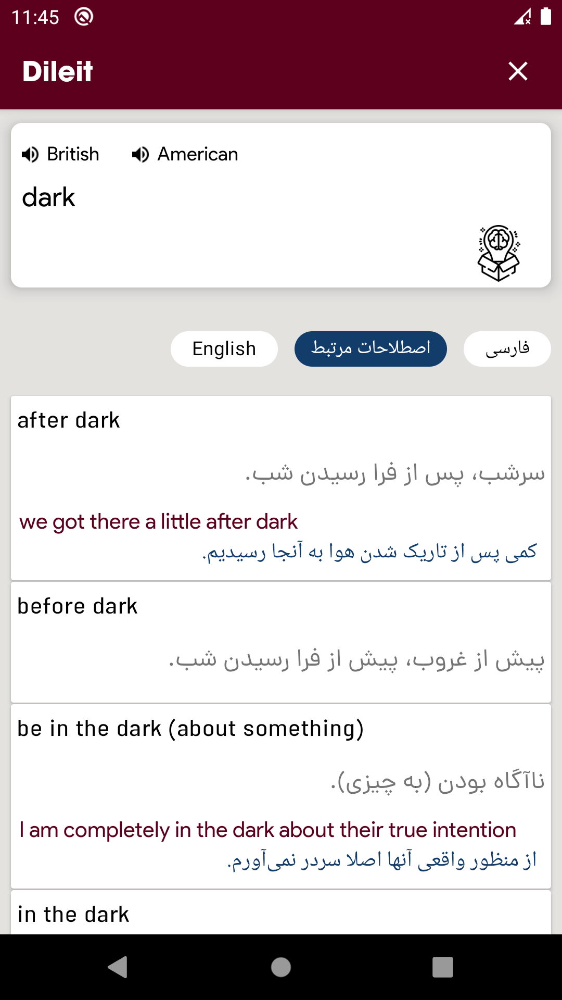
 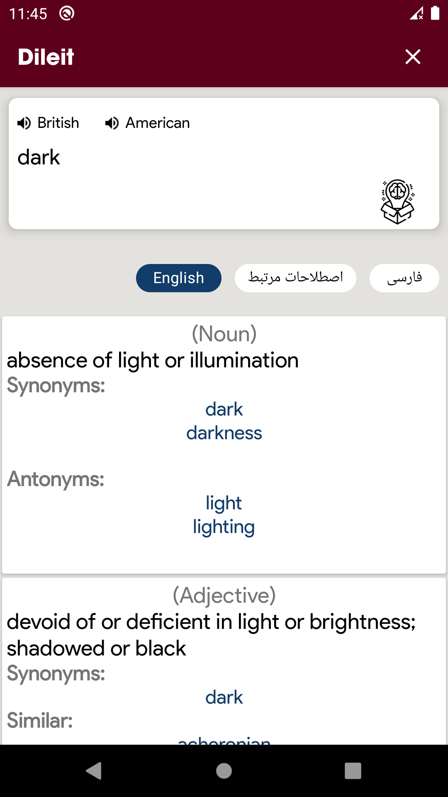
 

**3-Add to Leitner System**

in each word page, you can easily add a word in the Leitner system to learn it.

 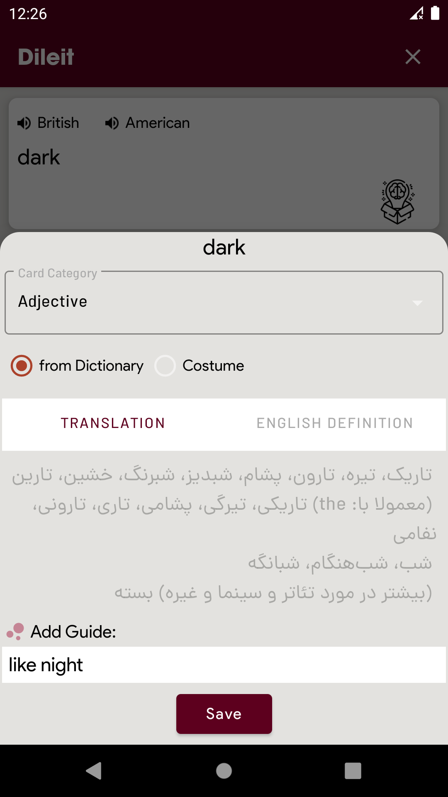
 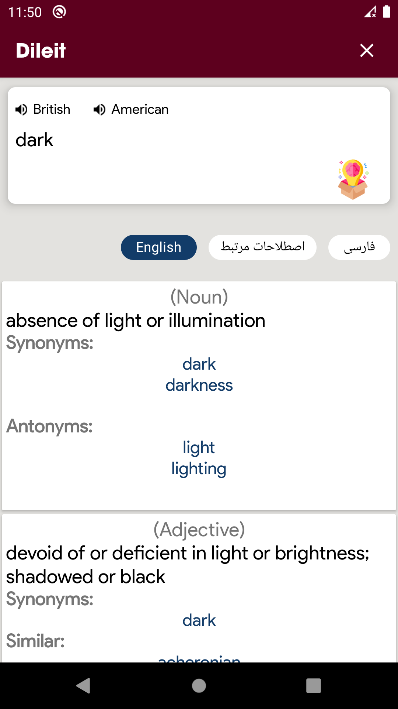
 

**4-Add costumized card**

you can add phrases,words, idioms (which do not exist in the dictionary) or anything you want to learn by Leitner system.

 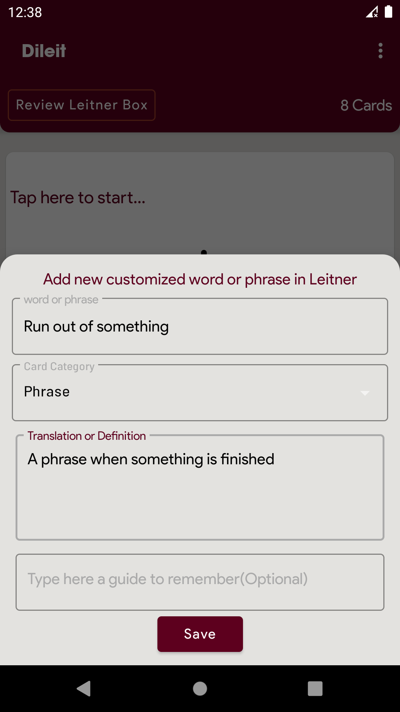
 

**4-Review Cards**

for learning words you should review added cards in specific times, `Dileit` handles it for you ;)

 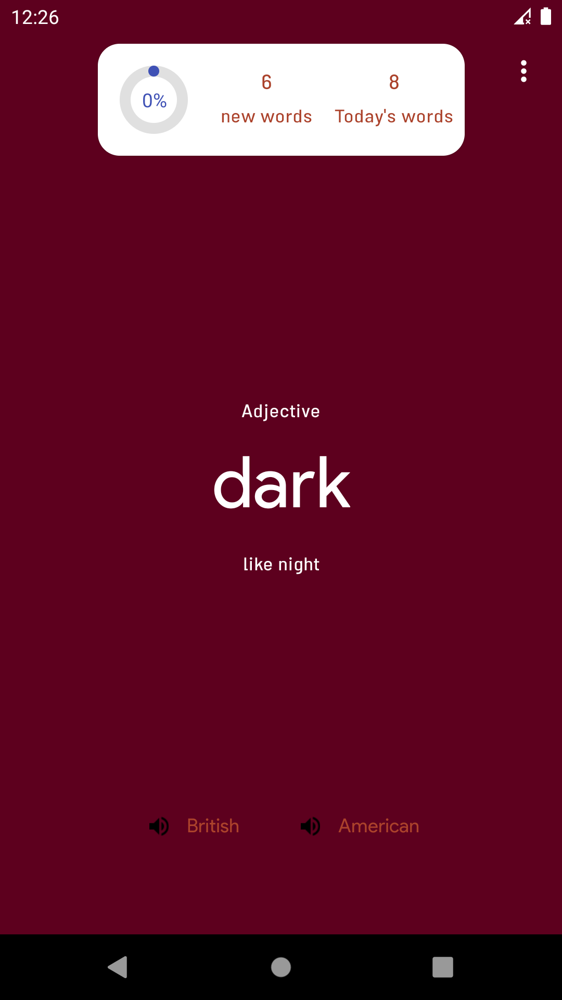
 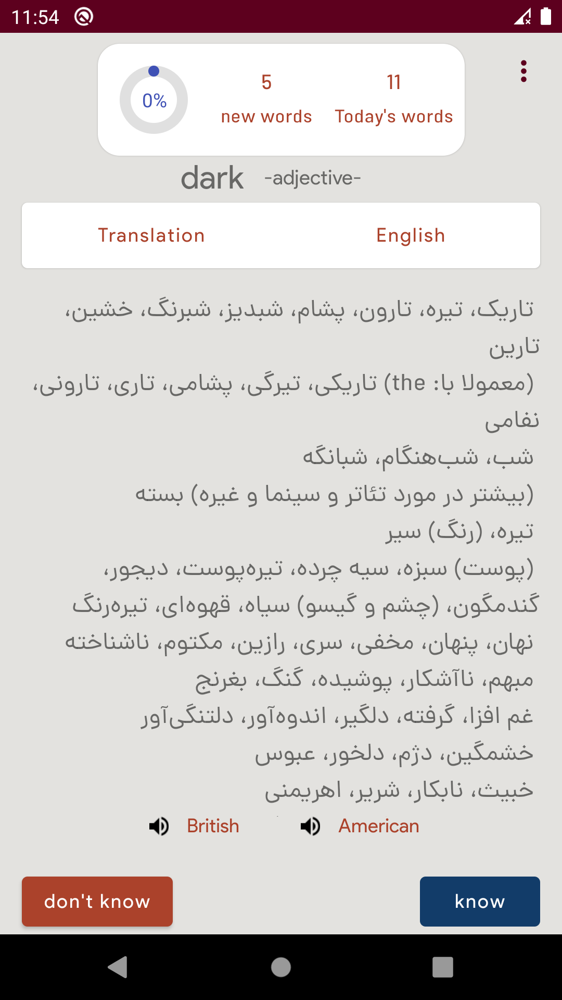
 

**5-Reminder**

If you like it, you can add a reminder for reviewing Leitner cards and `Dileit` reminds you by App Notification.

 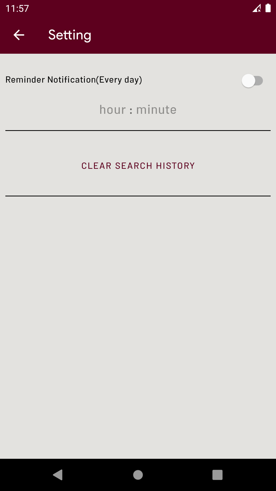
 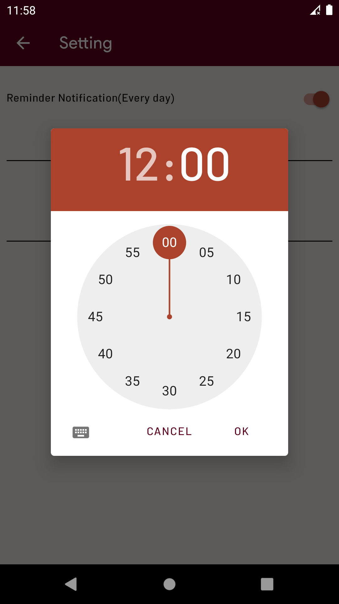
 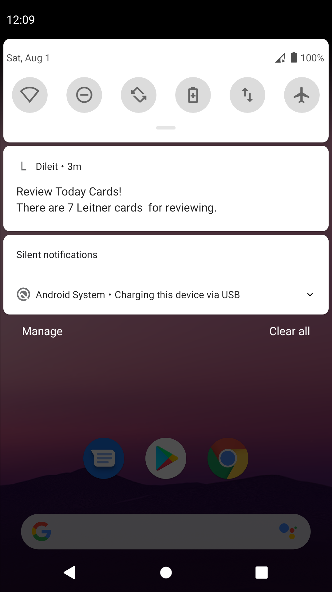

**6-Manage cards**

you can edit, remove and watch all Leitner cards and see the state of them in the progress of learning.

 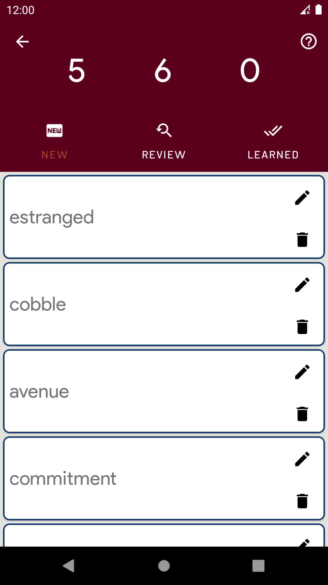
 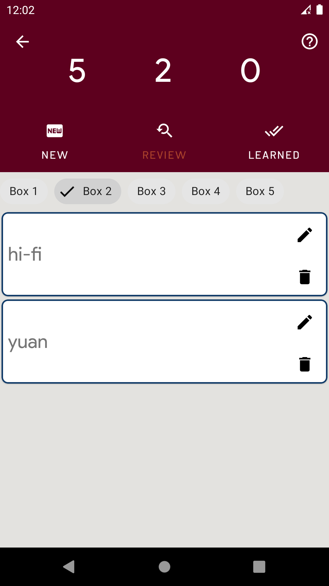

**7-Reporter**

it has always been good to track your progress!

 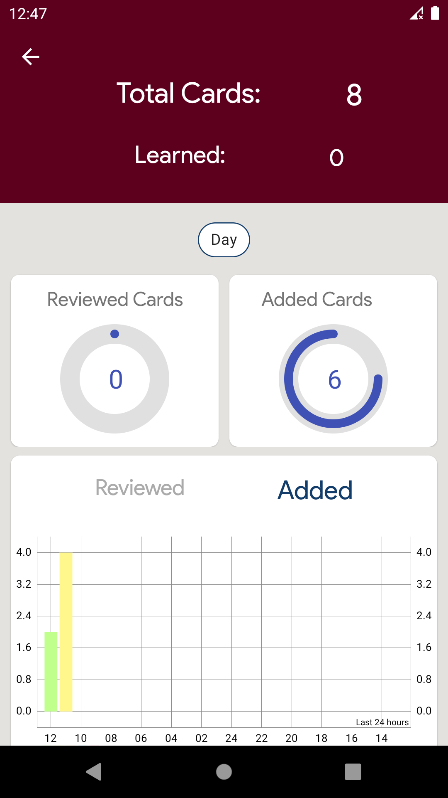

